<h1>Hello Viewer,</h1>

The world of machine Learning has been advancing for at a very high space and it is helping us developing our current technologies by making it a possibility to let our programs analyse like humans.

Artificial Intelligence(A.I) has been one such application of machine Learning which has already started making our life easier like Google Assistant, Alexa etc. 

But all these AI and all need some data with them that can help us with all the predictions and detection.

This project is actually to detect object using one such model called <b>VGG16</b>

<h3>VGG16</h3>

VGG16 is a model that already has some set of Keras Layers created and arranged in a Sequence and is mostly tested model.

 

<h1>Lets Begin,</h1>

In this project I will be using the VGG 16 with the concept of Transfer Learning that will help me identify the object based on the data I have provided.

The project can be divided into 4 sections...

<h3>First Section</h3>

In this we will first Create the model of the VGG16 and also download the Imagenet dataset...

Now we need to check what layers are trainable...

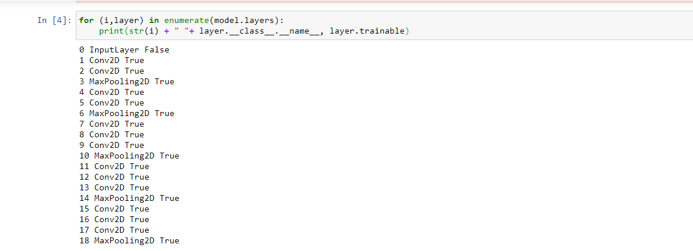

We are actually using the Transfer Learning concept, but first we need to freeze the layer...

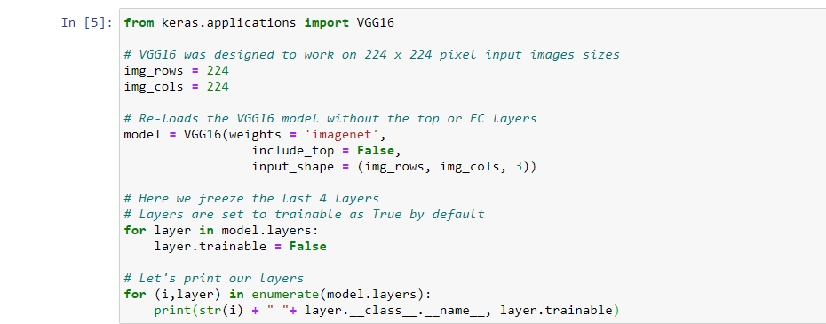

after this we dont have to worry about the precreated VGG16 Model.

<h3>Second Section</h3>

In this section we will add our own layers and thereby actually adding more filters to increase the accuracy...

We created a function for it that will add the layers...

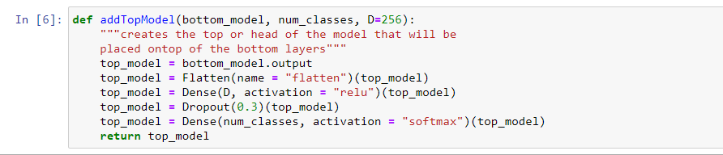

We will now check for the input shape that will help us to get the idea of the shape of the image the model needs...

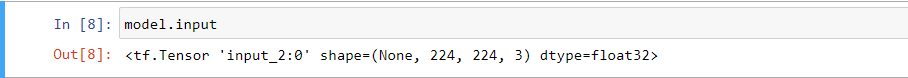

from this we came to know that we need an input shape of 224x224 and it can be in 3-color range i.e, BGR.

Now we will easily gather all the above part...

<h3>Third Section</h3>

This section will collect the real time photo collection and will helpl us gather the data that needs to be detected...

 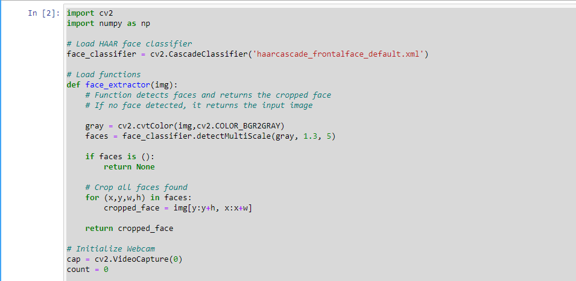
 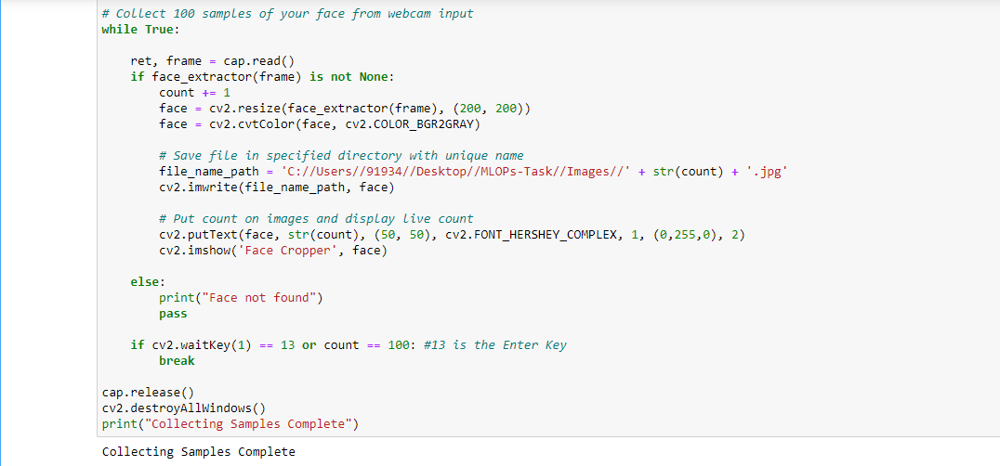
 
 This will collect the images that will help us to detect...
 
 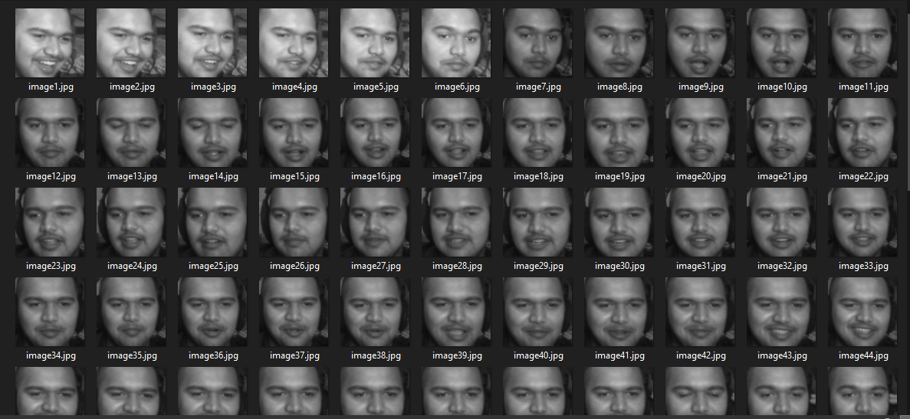
 
 <h3>Fourth Section</h3>
This section will actually pre-process the image so that it can be reshaped to 224x224 and also can be split into testing and training...

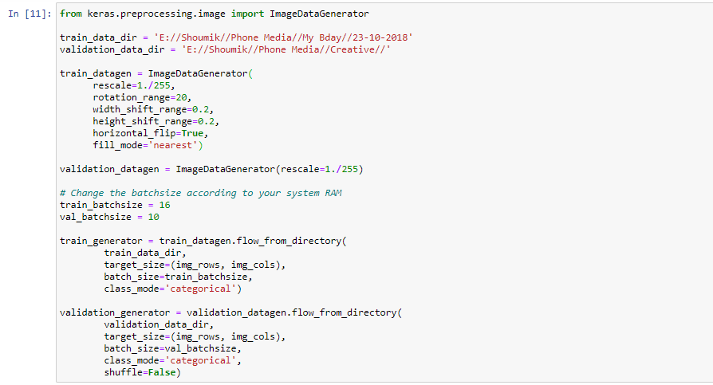

also the images in training and testing is counted...

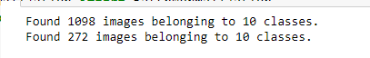

<h4>Now the model needs to be trained...
 
 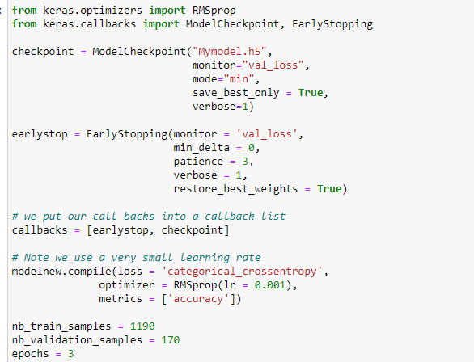
 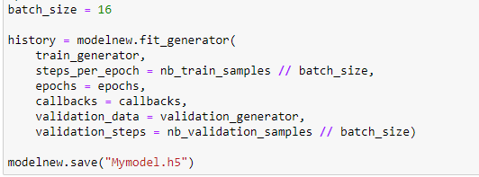
 
 With this now we can train the model and then predict it with the saved model.
 
 If you have any Query you can contact via Whatsapp:9338455463(No calls plzzz)...
 
 <h1>Thank You.</h1>
